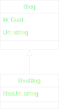
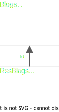

### Entity Framework Core Entity-Type Table Mapping

Entity Framework Core (version 7 and higher) supports different ways to map entity-types to relational database tables.

These mappings are:

- TPH ... Table-Per-Hierarchy
- TPT ... Table-Per-Type
- TPC ... Table-Per-Concrete

For detailed information visit:

- https://learn.microsoft.com/en-us/ef/core/modeling/inheritance

#### **Entity-Type Hierarchy Mapping**

In this article we will use the following sample entity-type hierarchy.

<p align="center">
    
</p>

You can browse the entity-type and DbContext classes here [`Blog`](./src/EFCore.TableMapping.Shared/Entities/Blog.cs), [`RssBlog`](./src/EFCore.TableMapping.Shared/Entities/RssBlog.cs) and [`RootDbContextBase`](./src/EFCore.TableMapping.Shared/Database/RootDbContextBase.cs).

```cs
public class Blog
{
    public Guid Id { get; set; }
    public string Url { get; set; }

    protected Blog(Guid id, string url)
    {
        Id = id;
        Url = url;
    }

    public static Blog Create(string url)
    {
        return new Blog(Guid.NewGuid(), url);
    }
}

public class RssBlog : Blog
{
    public string RssUrl { get; set; }

    private RssBlog(Guid id, string url, string rssUrl) : base(id, url)
    {
        RssUrl = rssUrl;
    }

    public static RssBlog Create(string url, string rssUrl)
    {
        return new RssBlog(Guid.NewGuid(), url, rssUrl);
    }
}

public abstract class RootDbContextBase : DbContext, IRootDbContext
{
    public DbSet<Blog> Blogs { get; set; } = null!;
    public DbSet<RssBlog> RssBlogs { get; set; } = null!;
}
```

#### **Default Entity-Type Configuration**

The following entity-type configuration is valid for all table mappings. See class [`RootDbContextBase`](./src/EFCore.TableMapping.Shared/Database/RootDbContextBase.cs).

```cs
public abstract class RootDbContextBase : DbContext, IRootDbContext
{
    protected override void OnModelCreating(ModelBuilder modelBuilder)
    {
        base.OnModelCreating(modelBuilder);

        modelBuilder.Entity<Blog>(entity =>
        {
            entity.HasKey(e => e.Id);

            entity.Property(e => e.Id)
                .ValueGeneratedNever()
                .IsRequired();

            entity.Property(e => e.Url)
                .HasMaxLength(100)
                .IsRequired();
        });

        modelBuilder.Entity<RssBlog>(entity =>
        {
            entity.Property(e => e.RssUrl)
                .HasMaxLength(200)
                .IsRequired();
        });
    }
}
```

#### **Table-Per-Hierarchy Mapping and Configuration**

TPH table mapping:

<p align="center">
    
</p>

The following entity-type configuration is valid for TPH table mapping. See class [`AppDbContextTph`](./src/EFCore.TableMapping.WebApi.Tph/Database/AppDbContextTph.cs).

```cs
public class AppDbContextTph : RootDbContextBase
{
    protected override void OnModelCreating(ModelBuilder modelBuilder)
    {
        base.OnModelCreating(modelBuilder);

        modelBuilder.Entity<Blog>(entity =>
        {
            entity.UseTphMappingStrategy();

            entity.ToTable("Blogs");

            entity.HasDiscriminator<string>("BlogType")
                .HasValue<Blog>(nameof(Blog))
                .HasValue<RssBlog>(nameof(RssBlog));
        });

        modelBuilder.Entity<RssBlog>(entity =>
        {
            entity.HasBaseType<Blog>();
        });
    }
}
```

#### **Table-Per-Type Mapping and Configuration**

TPT table mapping:

<p align="center">
    
</p>

The following entity-type configuration is valid for TPT table mapping. See class [`AppDbContextTpt`](./src/EFCore.TableMapping.WebApi.Tpt/Database/AppDbContextTpt.cs).

```cs
public class AppDbContextTpt : RootDbContextBase
{
    protected override void OnModelCreating(ModelBuilder modelBuilder)
    {
        base.OnModelCreating(modelBuilder);

        modelBuilder.Entity<Blog>(entity =>
        {
            entity.UseTptMappingStrategy();

            entity.ToTable("Blogs");
        });

        modelBuilder.Entity<RssBlog>(entity =>
        {
            entity.HasBaseType<Blog>();

            entity.ToTable("RssBlogs");
        });
    }
}
```

#### **Table-Per-Concrete Mapping and Configuration**

TPC table mapping:

<p align="center">
    
</p>

The following entity-type configuration is valid for TPC table mapping. See class [`AppDbContextTpc`](./src/EFCore.TableMapping.WebApi.Tpc/Database/AppDbContextTpc.cs).

```cs
public class AppDbContextTpc : RootDbContextBase
{
    protected override void OnModelCreating(ModelBuilder modelBuilder)
    {
        base.OnModelCreating(modelBuilder);

        modelBuilder.Entity<Blog>(entity =>
        {
            entity.UseTpcMappingStrategy();

            entity.ToTable("Blogs");
        });

        modelBuilder.Entity<RssBlog>(entity =>
        {
            entity.HasBaseType<Blog>();

            entity.ToTable("RssBlogs");
        });
    }
}
```

#### **Run web-API Applications**

Run applications:

```sh
$ ./app_run.sh tph # table-per-hierarchy
$ ./app_run.sh tpt # table-per-type
$ ./app_run.sh tpc # table-per-concrete
```

Then open Swagger API explorer:

```url
https://localhost:7196/swagger
http://localhost:5102/swagger
```

#### **Toolchain Requirements and Versions**

```sh
$ dotnet --info
    .NET SDK:
    Version: 7.0.306

    .NET SDKs installed:
    7.0.306

    .NET runtimes installed:
    Microsoft.AspNetCore.App 7.0.9
    Microsoft.NETCore.App 7.0.9

$ dotnet ef --version
    Entity Framework Core .NET Command-line Tools
    7.0.10

$ sqlite3 --version
    3.39.5
```
